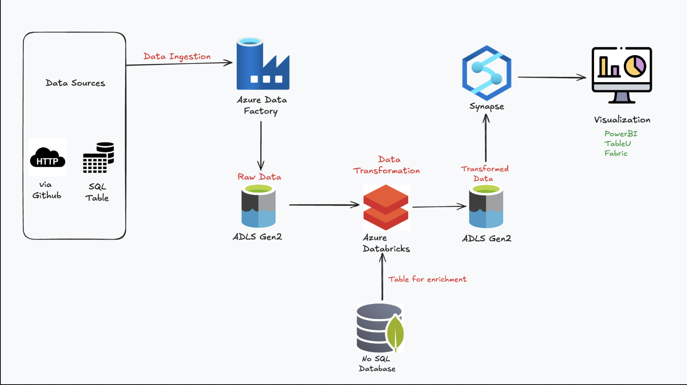
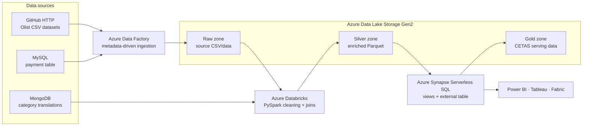
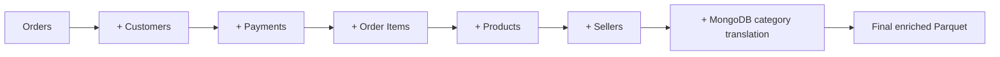

# Brazilian E-commerce Azure Data Engineering Project

[](https://azure.microsoft.com/products/data-factory)
[](https://azure.microsoft.com/products/storage/data-lake-storage)
[](https://azure.microsoft.com/products/databricks)
[](https://azure.microsoft.com/products/synapse-analytics)
[](https://www.mongodb.com/)

An end-to-end Azure data engineering project built on the **Brazilian E-commerce Public Dataset by Olist**. The solution ingests data from GitHub-hosted CSV files and database sources, lands raw files in Azure Data Lake Storage Gen2, transforms and enriches them with PySpark on Azure Databricks, and publishes query-ready Parquet through Azure Synapse Serverless SQL for downstream visualization.

> The project demonstrates multi-source ingestion, metadata-driven Azure Data Factory loops, lakehouse processing, NoSQL enrichment, delivery-performance feature engineering, serverless SQL views, and CETAS-based serving.



## Architecture



See [Architecture](docs/ARCHITECTURE.md) for expanded component and processing-flow diagrams. See [Data model and lineage](docs/DATA_MODEL.md) for source grains, joins, and the final analytical dataset.

## Project goals

- Ingest Olist e-commerce datasets from HTTP and database sources.
- Use a metadata file to drive repeatable ADF ingestion across multiple CSVs.
- Store source-aligned data in ADLS Gen2.
- Clean nulls and duplicates with PySpark.
- Engineer order-delivery performance metrics.
- Join customers, orders, payments, order items, products, sellers, and translated product categories.
- Publish the final dataset as Parquet.
- Query the lake with Synapse Serverless SQL.
- Materialize delivered-order data through CETAS for BI consumption.

## Data at a glance

The repository contains approximately **1.56 million source rows** across nine CSV files.

| Dataset | Rows | Grain |
|---|---:|---|
| Geolocation | 1,000,163 | One geographic coordinate record per ZIP-prefix observation |
| Order items | 112,650 | One line item per order/item sequence |
| Order reviews | 104,719 | One review record per review/order combination |
| Order payments | 103,886 | One payment installment/method record per order sequence |
| Customers | 99,441 | One row per order-specific customer ID |
| Orders | 99,441 | One row per order |
| Products | 32,951 | One row per product |
| Sellers | 3,095 | One row per seller |
| Category translation | 71 | One Portuguese-to-English product category mapping |

## End-to-end data flow

1. `ForEachInput.json` supplies GitHub-relative CSV paths and target filenames to Azure Data Factory.
2. ADF iterates through the configured files and lands source data in ADLS Gen2.
3. The companion ingestion notebook can load payment data into MySQL and category translations into MongoDB.
4. Databricks reads eight Olist datasets from ADLS and the category mapping from MongoDB.
5. PySpark removes null-containing and duplicate records from the source DataFrames.
6. Order timestamp fields are converted to dates.
7. Delivery metrics are derived: actual delivery time, estimated delivery time, delay flag, and delay duration.
8. Orders are enriched through successive joins to customers, payments, items, products, sellers, and category translations.
9. Duplicate-named columns are removed, and the final result is overwritten as Parquet in the Silver lake path.
10. Synapse Serverless SQL exposes the Silver files through views, filters delivered orders, and uses CETAS to write the curated result to the Gold zone.

## Technology stack

| Capability | Technology | Purpose |
|---|---|---|
| Public dataset | Olist Brazilian e-commerce data | Supplies realistic marketplace data |
| Orchestration | Azure Data Factory | Ingests multiple sources using a metadata-driven loop |
| Raw and curated storage | ADLS Gen2 | Stores source and transformed files |
| Distributed processing | Azure Databricks + PySpark | Cleans, enriches, joins, and writes Parquet |
| Relational source simulation | MySQL | Hosts order-payment records |
| NoSQL enrichment | MongoDB | Hosts product-category translations |
| Query/serving | Synapse Serverless SQL | Reads lake Parquet through `OPENROWSET` and CETAS |
| Visualization | Power BI, Tableau, or Fabric | Consumes curated analytical data |

## Transformations

### Data quality

The reusable cleaning function applies:

```python
df.dropna().dropDuplicates()
```

Counts are printed before and after cleaning for every Spark DataFrame.

### Delivery-performance features

| Derived column | Definition |
|---|---|
| `actual_delivery_time` | Delivered-customer date minus purchase date |
| `estimated_delivery_time` | Estimated-delivery date minus purchase date |
| `delay` | Whether actual duration exceeded estimated duration |
| `Delay time` | Actual duration minus estimated duration |

### Enrichment chain



## Synapse serving layer

The SQL script demonstrates two serving patterns:

- `OPENROWSET` views over the Silver Parquet location
- CETAS (`CREATE EXTERNAL TABLE AS SELECT`) into a managed Gold path

`gold.final2` filters the dataset to `order_status = 'delivered'`, and `gold.finaltable` materializes that filtered result using an external Parquet file format and managed-identity-backed data source.

## Repository structure

```text
.
└── Project-AzureDatabricks/
    ├── Architecture Diagram.png
    ├── Data/                                  # Nine Olist CSV datasets
    ├── ForEachInput.json                      # ADF ingestion metadata
    ├── DataIngestionToDB(filess.io)/
    │   └── DataIngestionToDB.ipynb            # MySQL and MongoDB source setup
    ├── PySpark notebooks/
    │   └── Code for Data processing.ipynb     # Databricks transformation logic
    ├── sql code                               # Synapse views and CETAS
    └── notes.txt                              # Dataset and reference links
```

## Prerequisites

- Azure subscription
- Azure Data Factory
- ADLS Gen2 storage account and container
- Azure Databricks workspace
- Azure Synapse workspace with Serverless SQL
- Optional MySQL and MongoDB services for the database-source paths
- Managed identities or service principals with least-privilege access

## Setup and execution

### 1. Clone the repository

```bash
git clone https://github.com/AdarshDamarla-DataEngineer-Git/BigDataProjects.git
cd BigDataProjects/Project-AzureDatabricks
```

### 2. Create Azure resources

Provision ADF, ADLS Gen2, Databricks, and Synapse. Grant each service the required access to the lake. Use Key Vault or managed identity for credentials.

### 3. Configure ingestion

Upload or use `ForEachInput.json` as the ADF metadata source. Configure a parameterized HTTP dataset using the GitHub raw-content base URL and a parameterized ADLS sink dataset.

The current metadata file lists seven GitHub CSV datasets. Payment data is handled through the SQL-source path, while category translations are loaded into MongoDB for enrichment.

### 4. Prepare optional database sources

Open `DataIngestionToDB.ipynb`, configure connection details through secrets, and run the MySQL and MongoDB load sections. The notebook inserts payment rows in batches of 500 and publishes category mappings to the `product_categories` MongoDB collection.

### 5. Run the Databricks transformation

Import `Code for Data processing.ipynb`, replace the ADLS path placeholders, configure MongoDB credentials securely, and execute the notebook.

The final cell writes the joined dataset to a configured ADLS Parquet path.

### 6. Configure Synapse Serverless SQL

Update the lake URLs and credential names in `sql code`, then execute the statements in Synapse Serverless SQL. Use your own master-key password from a secure deployment mechanism—do not reuse the sample value committed in the original script.

### 7. Connect BI tools

Connect Power BI, Tableau, or Fabric to the Synapse Serverless endpoint and build reports from `gold.finaltable` or the lake views.

## Validation queries

```sql
-- All enriched records through the lake view
SELECT COUNT(*) AS row_count
FROM gold.final;

-- Delivered orders
SELECT order_status, COUNT(*) AS orders
FROM gold.final2
GROUP BY order_status;

-- Delivery performance
SELECT
  customer_state,
  COUNT(*) AS order_lines,
  AVG(CAST(actual_delivery_time AS FLOAT)) AS avg_delivery_days,
  SUM(CASE WHEN delay = 1 THEN 1 ELSE 0 END) AS delayed_order_lines
FROM gold.finaltable
GROUP BY customer_state
ORDER BY delayed_order_lines DESC;
```

## Analytics use cases

- Revenue and payment behavior by customer state
- Delivery performance and delay rates
- Product-category sales using English category names
- Seller performance and fulfillment metrics
- Freight cost versus item price
- Payment-method and installment trends
- Delivered versus cancelled order analysis
- Geographic marketplace coverage

## Recommended production improvements

- Define explicit Spark schemas instead of reading every CSV column as a string.
- Replace blanket `dropna()` with dataset-specific data-quality rules to avoid discarding valid partially populated records.
- Add validation for business keys, monetary values, dates, and join cardinality.
- Avoid `SELECT *` in serving views and external tables; publish a documented schema.
- Parameterize all storage accounts, containers, database endpoints, and table names.
- Store all credentials and master-key values in Azure Key Vault or platform secret stores.
- Write curated data incrementally and partition by a common analytical date when volume grows.
- Add CI/CD templates, automated tests, monitoring, alerting, and data reconciliation.

## Documentation

- [Architecture and processing flows](docs/ARCHITECTURE.md)
- [Data model and transformation lineage](docs/DATA_MODEL.md)
- [Deployment and operations](docs/DEPLOYMENT.md)

## Author

**Adarsh Damarla** · [GitHub](https://github.com/AdarshDamarla-DataEngineer-Git)

## Dataset credit

The sample data is based on the Brazilian E-commerce Public Dataset by Olist. Follow the dataset provider's terms when redistributing or using the data.

