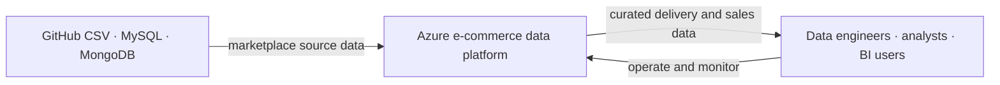
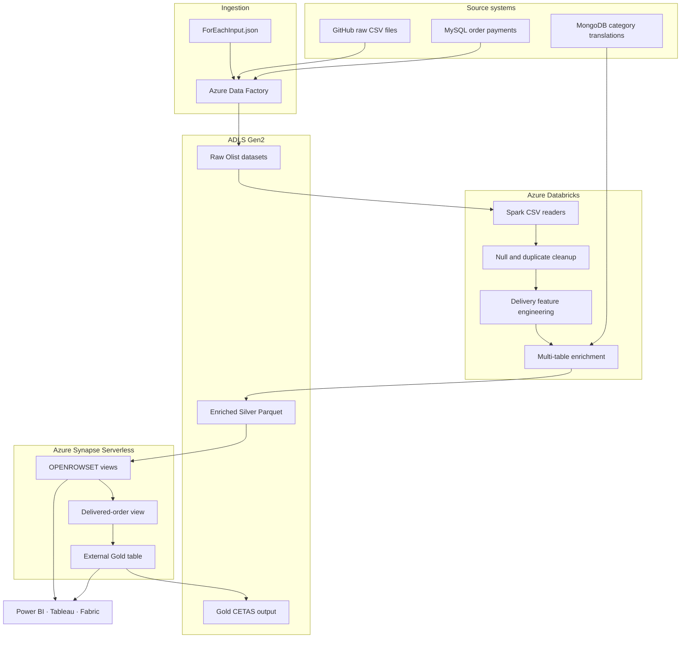
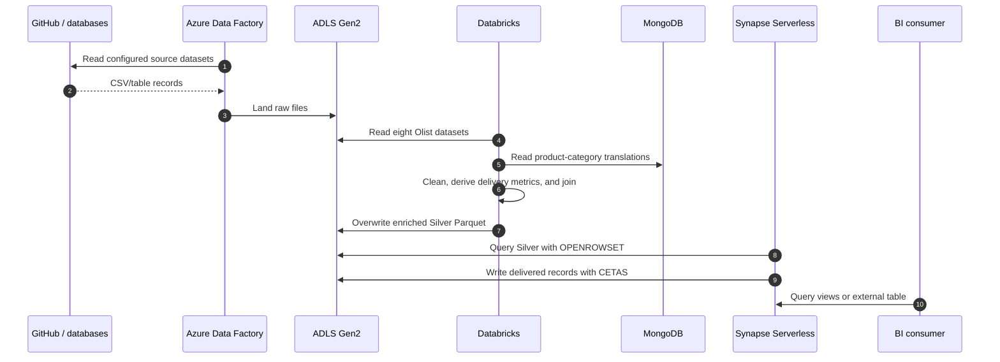
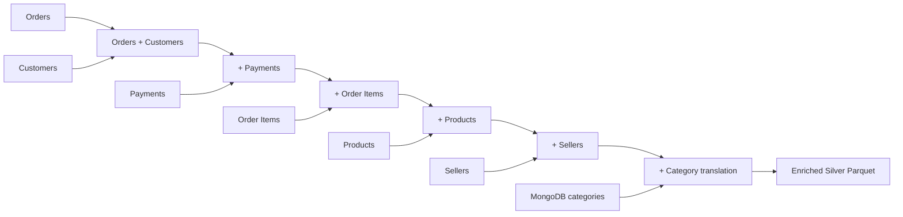

# Architecture

## System context

## Component architecture

## Processing sequence

## Transformation lineage

Reviews and geolocation are read and cleaned in the notebook but are not currently joined into `final_df`.

## Security boundaries

- ADF requires access to public HTTP sources and write access to ADLS.
- Databricks requires ADLS and MongoDB access.
- Synapse managed identity requires Silver read and Gold write permissions.
- Database credentials and Synapse master-key values should be supplied through secrets, not notebook variables or committed SQL.

## Failure boundaries

- A missing GitHub file or incorrect relative URL fails the related ingestion iteration.
- Blanket null removal can eliminate valid but incomplete records.
- Left joins preserve base orders but can multiply rows for multi-row payments and items.
- Overwrite mode replaces the complete Silver output on every successful run.
- Schema drift can affect `SELECT *` Synapse views and CETAS output.
