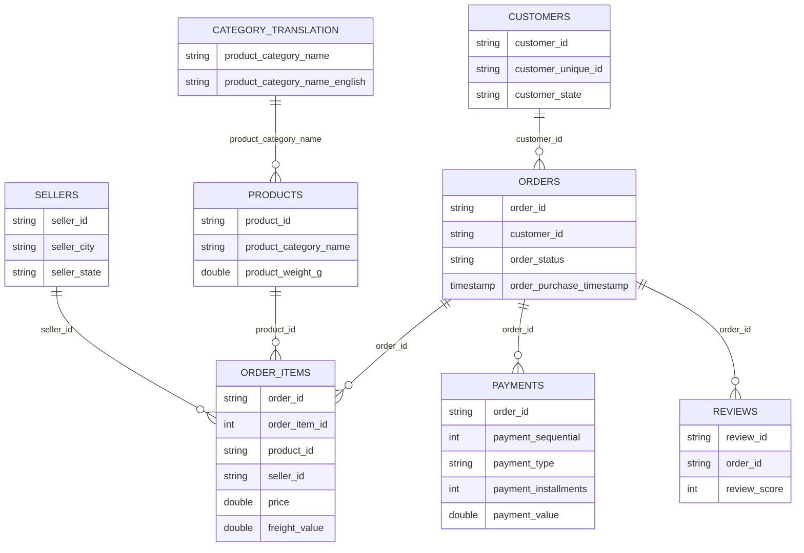

# Data model and lineage

## Source relationships



## Final dataset grain

The transformation starts with orders, then joins potentially multiple payments and multiple order items. The practical grain is therefore close to:

```text
one row per order × payment sequence × order item
```

This means order-level measures can be repeated across line/payment combinations. Aggregations should use the appropriate key and avoid summing repeated values without deduplication.

## Derived delivery columns

| Column | Expression | Interpretation |
|---|---|---|
| `actual_delivery_time` | `datediff(delivered_customer_date, purchase_date)` | Actual delivery duration in days |
| `estimated_delivery_time` | `datediff(estimated_delivery_date, purchase_date)` | Promised delivery duration in days |
| `delay` | Actual duration greater than estimated duration | Late-delivery indicator |
| `Delay time` | Actual duration minus estimated duration | Days late or early |

## Current join participation

| Dataset | Read | Cleaned | Joined into `final_df` |
|---|---:|---:|---:|
| Customers | Yes | Yes | Yes |
| Orders | Yes | Yes | Yes |
| Order items | Yes | Yes | Yes |
| Payments | Yes | Yes | Yes |
| Products | Yes | Yes | Yes |
| Sellers | Yes | Yes | Yes |
| Reviews | Yes | Yes | No |
| Geolocation | Yes | Yes | No |
| Category translation | MongoDB | Not through shared function | Yes |

## Suggested analytical marts

- `fact_order_items`: item-level revenue, freight, seller, product, order, and customer keys
- `fact_payments`: payment value, type, installments, and order key
- `fact_reviews`: review score and response timing
- `dim_customer`: unique customer geography
- `dim_product`: product attributes and translated category
- `dim_seller`: seller geography
- `dim_date`: purchase, approval, shipping, delivery, and review dates

Separating these grains prevents payment and item multiplication and creates clearer BI semantics.

## Example query

```sql
SELECT
  product_category_name_english,
  COUNT(DISTINCT order_id) AS orders,
  SUM(CAST(price AS FLOAT)) AS item_revenue,
  AVG(CAST("Delay time" AS FLOAT)) AS avg_delay_days
FROM gold.finaltable
GROUP BY product_category_name_english
ORDER BY item_revenue DESC;
```

## Data-quality recommendations

- Assert non-null and unique primary keys at their source grains.
- Validate order status against accepted values.
- Validate non-negative prices, freight, and payments.
- Check delivery timestamps are chronologically consistent.
- Monitor join match rates for customers, products, sellers, and categories.
- Reconcile item revenue, payment value, and order counts separately by grain.
